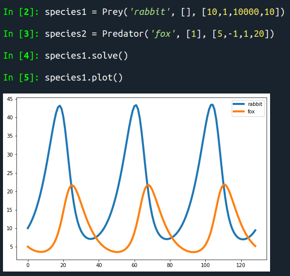

# Lotka_Volterra_N_species_model
The software here developed allows to set up and integrate a generalized [Lotka Volterra system](https://en.wikipedia.org/wiki/Generalized_Lotka%E2%80%93Volterra_equation), either via the IPython Console or using a script.

## Introduction to the model

In the field of population dynamics a very simple yet powerful model is based on the [Lotka Volterra equations](https://en.wikipedia.org/wiki/Lotka%E2%80%93Volterra_equations). 
It describes, using two ordinary non linear differential equations, the dynamics of biological systems in which two species interact, one as a predator and the other as a prey. The system arose in the early 1900s and since that time many generalizations have been developed, one of which is the case here under examination.

### Lotka Volterra Predator Prey model

In order to fix the ideas on the basic concepts, let's consider the original Predator-Prey model. 
We call x(t) the number of the preys and y(t) the number of predators, both at the time t. The simplest set of equation to describe their evolution is the following:

Where dx/dt and dy/dt are the instantaneous growth rate of the two populations. 
α represents the natural birth rate of the preys, while γ represents their predation rate. If we interpret xy as the probability for a prey and a predator to meet and interact, γ can be read as the fraction of times in which the prey is actually caught. 
Overall, the change over time of the number of the preys is given by the balance between the rate at which they're born and the rate at which they're predated.  

Simmetrically β is the natural death rate of the predators, that are supposed to die if no predation occurs, while δ is their hunting efficiency. Note that γ and δ are different costants, since the gain percieved by predators can differ from the loss percieved by the preys. It can be roughly considered as the amount of preys needed to feed a predator. 

The system just described behaves in an oscillatory fashion, as shown in the following figure.

Note that in absence of interaction, the predators are assumed to die while the preys are assumed to grow exponentially and with no limit. A development of the previous system is to limit the natural resources for the preys, with a term quadratic in x representing the intraspecific competition for the food. The modified equations have the following form:

&space;-&space;\gamma&space;xy&space;>)

where K, called carrying capacity in ecology, here directly represents the maximum number of preys that the ecosystem in absence of predators can feed at once.
This new scenario leads to different solutions. Let's now analyze the N species generalization.

### Lotka Volterra N species model

The set of equations can be written

&space;)&space;-&space;\frac{1}{c_i}&space;\sum_{i\neq&space;j}&space;a_i_j&space;x_i&space;x_j&space;&space;>)

The equation form is analogous to that of the simpler model.
θ(k) is the Heaviside function, defined as

θ(k) = 1    if    k > 0  
θ(k) = 0    if    k < 0

and it assures that the limited growth is applied only to preys, while predators have and no other limit in growth than the presence of preys. 
The summatory defines the interaction of the i-th species with all the others, both in intensity and in quality: aij > 0 represents a loss for the species i against the species j. Simmetrically, the gain for the species j will be aji = -aij. Thus the interaction matrix A has to be antisymmetric. The 1/ci factors represent the relative velocity at which a particular species changes the number of its individuals, with respect to the number of interactions with all the other species. The interaction matrix coefficents can be interpreted as the coupling between the different species (0 coupling means total indifference).
Note that the intraspecific competition term (the quadratic term in xi) can be included into the summatory, through the definition

&space;>)

## Software structure

The software is made up of three main modules:  
***sysFunctions***, that implements simple functions used in system.  
***system***, where the objects exploited by the user to set up the system are defined.  
***systemDynamicGenerator***, that generates a new module ***integrator*** for the system integration.  
Thus the dataflow is the following:  
***system*** ---setup data--->***systemDynamicGenerator***---dynamical generation--->***integrator***--->solution  
&nbsp;&nbsp;&nbsp;&nbsp;&nbsp;&nbsp;&nbsp;&nbsp;&nbsp;&nbsp;&nbsp;&nbsp;&nbsp;&nbsp;&nbsp;&nbsp;&nbsp;&nbsp;&nbsp;&nbsp;&nbsp;&nbsp;&nbsp;&nbsp;&nbsp;&nbsp;|______________________________________________________^  

## Usage examples

In a typical execution, the file ***system*** is run and the system is set up and solved from the command line.  
A new species is introduced to the system as an instance of one of the classes Species, Prey or Predator. The syntax is the following:

| **Method**     	| **Parameter**                                                              	| **Function**                                                                                                                                                                                                                                      	|
|----------------	|----------------------------------------------------------------------------	|---------------------------------------------------------------------------------------------------------------------------------------------------------------------------------------------------------------------------------------------------	|
| addSpecies     	| name: string                                                               	| The list of species of the system is updated with this name.                                                                                                                                                                                      	|
| setInteraction 	| name1: string  name2: string value: float                            	| This method is used to specify the kind of interaction of name1 with respect of name2. The interaction matrix is updated with value.   A positive value means that name1 eats name2.   A negative value means that name1 is eaten by name2. 	|
| setInitialCond 	| name: string    value: float                                            	| This method sets the initial population of species 'name' equal to 'value'.                                                                                                                                                                       	|
| setGrowthRate  	| name: string    value: float                                            	| This method sets the growth rate of species 'name' equal to 'value'.                                                                                                                                                                              	|
| setCarrCap     	| name: string  value: float                                              	| This method sets the carrying capacity of species 'name' equal to 'value'.                                                                                                                                                                        	|
| setChangeRate  	| name: string  value: float                                              	| This method sets the change rate of species 'name' equal to 'value'.                                                                                                                                                                              	|
| removeSpecies  	| name: string                                                               	| This method removes from the system the species 'name' and all its interactions with the other species.                                                                                                                                           	|
| status         	| name: string (optional)                                                 	| This method prints the status of the system, if no arguments are given.   If the name of a species is given, the method prints the current value of its parameters and interactions.                                                           	|
| solve          	| max_time: float   (default: 20)  t_steps: int   (default: 129) 	| max_time specifies the maximum time reached in the integration.      t_steps specifies the number of steps in which the time is divided.   In the form 2^n +1 performance is increased.                                                  	|
| plot           	|                                                                            	| This method plots the solution contained in the file solution.csv.                                                                                                                                                                                	|
| saveSetup      	| name: string (optional)                                                 	| The current setup of the system is saved into the folder 'saved_setups'.   If 'name' is not given, it will be saved with the current date and time inside the name.                                                                            	|
| saveSolution   	| name: string (optional)                                                 	| The solution of the system is saved into the folder 'saved_solutions'.   If 'name' is not given, it will be saved with the current date and time inside the name.                                                                              	|
| loadSetup      	| name: string                                                               	| The system is initialized with the status given by the file 'name', that should be a setup previously saved or already present in the folder 'saved_setups'.                                                                                      	|

species1 = Species('name', 'interactions', 'parameters')  
***Name*** (string) is the name of the Species created. It univocally identifies it, so it cannot be the same of an already implemented species.  
***Interactions*** (list) defines the interaction coefficients of this species with respect to all the others. Thus its length should be equal to the number of species already instanciated (if it's smaller it is padded with zeros, meaning total indifference between the species).  
The order of the coefficients depends on the order in which the other species have been implemented: if 'Rabbit' has been added first in the system, its interaction list is empty. When 'Fox' is added, his list will be of length 1. If a third species is then implemented, his 'interactions' argument is a list of length 2, with the first number referring to its interaction coefficient with respect to 'Rabbit' and the second number referring to 'Fox'. The current status of the system can always be checked with the method 'status' of any of the species, as shown below.

  

***Sign of the interaction***: whenever a species is introduced, the system wil be updated accordingly. In particular, one can imagine that if two species 'A' and 'B' are already present, the introduction of C with interactions = [1,-1] will add to the system the following information:  
('C','A') : 1  
('C','B') : -1  
That should be read as:  
'C eats A'  
'C is eaten by B'  
 Thus passing as argument the list of interactions, one should ask himself for interaction i:  
 "Does this species eat species i (in such a case, a positive value should be inserted), or is this species eaten by species i (negative value)?"  
***Parameters*** (list) is the list of the parameters specific to this species. Length should be equal to 4 (if it's smaller the missing values are set to 0.5).  
The first value is the initial value for population number, n0. It must be positive.  
In the equation:  

&space;)&space;-&space;\frac{1}{c_i}&space;\sum_{i\neq&space;j}&space;a_i_j&space;x_i&space;x_j&space;&space;>)

Parameter 1  = ki (Growth/death rate, depending on the sign)  
Parameter 2 = Ki (Carrying capacity. It is not used by the equations related to predators, it can be set to any number.)  
Parameter 3 = ci (It must be positive)  
  
The objects Prey and Predator need the same arguments as Species, but they check and correct the given input to allign it to the declared behaviour of the species. For example, they can change the sign of a negative growth rate given to a Prey, while logging a warning to the user. For species not completely preys or predators, e.g. a fox that eats rabbits but is eaten by wolves, the object Species can be used.  

It is possible to remove one species through the command del, for example to change its parameters. In such a case all the remaining species will be updated loosing the interaction coefficients with the removed one. So introducing it again, the input will be different:  
  
spec1 = Prey('rabbit', [ ], [10, 1, 10000, 10])&nbsp;&nbsp;&nbsp;&nbsp; # No interaction since this is the only species present  
spec2 = Predator('fox', [1], [5, -1, 1, 20])&nbsp;&nbsp;&nbsp;&nbsp;&nbsp;&nbsp;&nbsp;&nbsp;&nbsp;&nbsp; # The interaction of 'fox' with 'rabbit' is positive.  
del spec1  
spec1 = Prey('rabbit', [-1], [10, 1, 10000, 10])&nbsp;&nbsp;&nbsp; # The interaction coefficient with 'fox' must be specified again. It's negative this time.  
  
The last two methods needed to the user are 'solve' and 'plot'. The first accept the following parameters:  
***Maximum time*** (float, default=20), that is the maximum time reached in the integration, starting from 0.  
***Time steps*** (int, default=2^7+1), that are the number of steps in which 'maximum time' is divided. In the form (2^n)+1 performance is increased.  
An example of a simple execution is the following, replicating the Predator Prey model:  

  
In the following example, the system with 2 preys and 1 predator has been replicated.  
sp1 = Species('Prey 1', [ ], [30, 0.09, 10000, 400])  
sp2 = Species('Prey 2', [1], [10, 0.06, 10000, 500])  
sp3 = Species('Predator', [1,1], [20, -0.05, 10000, 250])  
sp1.solve(500)  
sp1.plot()  

  
  
